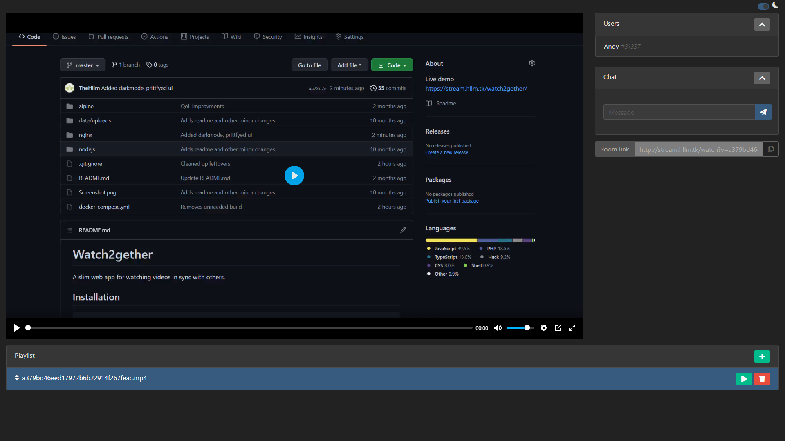

# Stream
A slim web app for watching videos in sync with others.
## Installation
```
git clone git@github.com:TheHllm/stream.git
cd stream
docker-compose up
```
The app is now avalible at `127.0.0.1:1234`

## Screenshot

